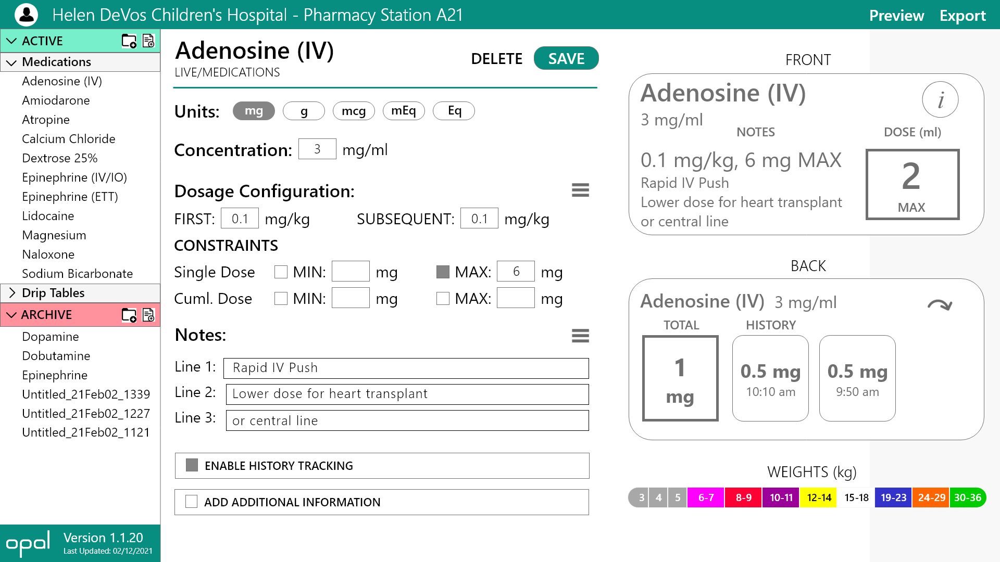

# Opal Medical Technologies: iCart Desktop Application

Desktop application written in React and using Electron. Interface built for pharmacists to enter inventory information to update the iCart mobile application.

## Installation:
1. Make sure that Node and react are installed.
2. Remove node_modules package-lock.json if they exist.
3. Run npm install
4. For development, run npm start and navigate to localhost:3000 to view the app.

## Screenshots:

## Credit:
The application is developed by Opal Medical Technology LLC.

Joshua Fink, Rahul Gopinath, Runxuan Jiang, and Ameer Mubarez

Outside use is not permitted
